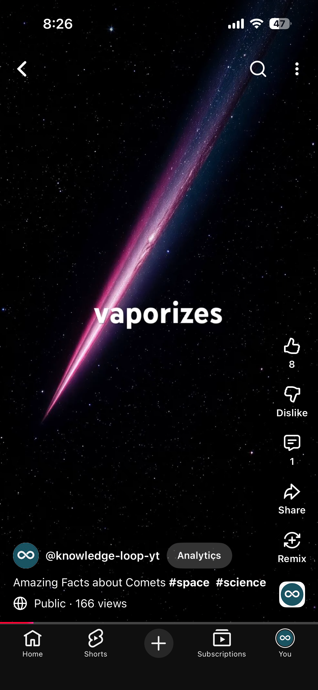
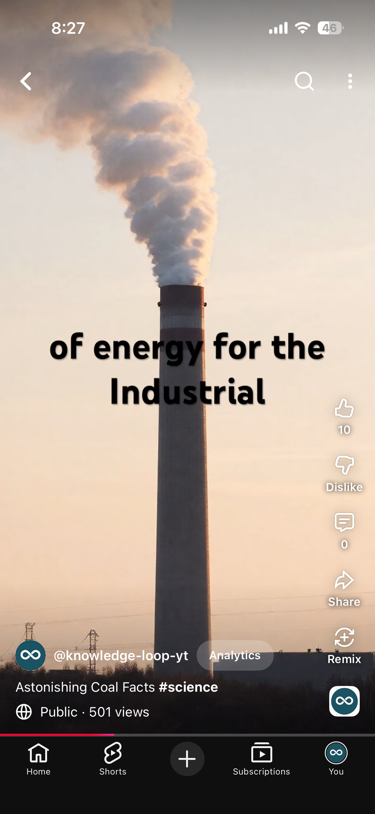

# Automatic Content Creator

Automatic Content Creator is a Python toolchain that generates short vertical videos (YouTube Shorts style) from a topic list. It generates a script using a generative model, fetches images for each script segment, synthesizes speech for each script line, and composes the media into a final video using FFmpeg.

**Screenshots from YouTube Shorts created through Automatic Content Creator**



## Features
- Generates a short script for a single video topic using a generative model (`script_fetcher.py`).
- Downloads vertical images sized to 1080x1920 (`image_fetcher.py`).
- Synthesizes speech using AWS Polly (`speech_fetcher.py`).
- Concatenates image+audio pairs into a single vertical video using FFmpeg (`editor.py`).
- Organizes outputs under `res/` and maintains a video counter in `acc_data.json`.

## Requirements
- Python 3.8+ (tested with 3.10+)
- System FFmpeg installed and available on PATH (the editor invokes `ffmpeg` via subprocess).
- The Python dependencies listed in `requirements.txt`:

```bash
pip install -r requirements.txt
```

Contents of `requirements.txt`:

- requests
- google-generativeai
- boto3
- moviepy

## Configuration & Secrets
- The project expects certain credentials to be supplied as environment variables at runtime:
  - `GEMINI_API_KEY` — used by `script_fetcher.py` to call the Gemini generative model.
  - `AWS_ACCESS_KEY_ID` and `AWS_SECRET_ACCESS_KEY` — used by `speech_fetcher.py` to call AWS Polly.

- Minor configuration files (examples exist in the repo):
  - `video_config.json` — contains video sizing/clip-duration parameters.
  - `paths.json` — path hints used by some components.

Ensure `acc_data.json` exists and contains a numeric `video_counter` field (the code reads and updates the counter). Example:

```json
{
  "video_counter": 0
}
```

## Input Files
- `topics.txt` — the list of topics (one per line) used by `script_fetcher.py` to pick a topic.
- `topics-covered.txt` — keeps track of topics already used; `script_fetcher.py` appends the chosen topic here.
- `prompt-base.txt` — base prompt template used by `script_fetcher.py` to ask the generative model to write the script.

The script generator writes a `prompt.txt` and then `script.txt`. `main.py` expects the generated `script.txt` to be formatted as follows:
- Line 1: video title (used to create the output directory name)
- Remaining lines: one segment per line in the form `image_prompt|speech_text` (pipe-separated). `main.py` splits each line on `|` to obtain the image prompt and the speech text.

## How it works (high level)
1. `main.py` calls `script_fetcher.get_script('script.txt')` to produce `script.txt`.
2. `main.py` reads the first line of `script.txt` as the video title, then creates a `res/<counter>_<sanitized_title>/` directory.
3. For each `image_prompt|speech_text` line, `main.py` calls:
   - `image_fetcher.get_image(output_image_path, prompt)` — downloads an image from Pollinations.
   - `speech_fetcher.get_speech(output_speech_path, text)` — synthesizes MP3 using AWS Polly.
4. `main.py` collects all image/audio pairs into `media_sets` and calls `editor.run_editor(media_sets, TEMP_OUTPUT_NAME)`.
5. `editor.py` uses FFmpeg to create intermediate video clips per pair and concatenates them into the final output video.
6. `main.py` performs cleanup and increments `video_counter` inside `acc_data.json`.

## Running
1. Install dependencies:

```bash
pip install -r requirements.txt
```

2. Export required environment variables (example):

```bash
export GEMINI_API_KEY="your_gemini_key"
export AWS_ACCESS_KEY_ID="your_aws_key"
export AWS_SECRET_ACCESS_KEY="your_aws_secret"
```

3. Ensure `acc_data.json` exists and has a `video_counter` field.

4. Run the main script:

```bash
python3 main.py
```

The script will create a new folder under `res/` named like `0_MyVideoTitle/` and place `images/`, `speech/` and a timestamped MP4 output inside it.

Note: the `editor.py` commands use shell-invoked `ffmpeg` (the code currently prefixes `sudo` in the command strings). Ensure your environment can run `ffmpeg` without interactive sudo prompts or adjust the code to remove `sudo`.

## File map (core files)
- [main.py](main.py): Orchestrates the full run — generates script, fetches images + audio, and invokes the editor.
- [script_fetcher.py](script_fetcher.py): Chooses a topic and will call the generative model (Gemini) to write `script.txt`.
- [image_fetcher.py](image_fetcher.py): Downloads an image for a prompt (uses Pollinations API URL pattern).
- [speech_fetcher.py](speech_fetcher.py): Uses AWS Polly (boto3) to synthesize speech to MP3 files.
- [editor.py](editor.py): Invokes FFmpeg to convert image+audio pairs into intermediate MP4 clips and concatenates them.
- [utilities.py](utilities.py): Small helper to read JSON values.
- [requirements.txt](requirements.txt): Python runtime dependencies.
- [video_config.json](video_config.json): video timing/config sample.
- [paths.json](paths.json): path configuration sample.

## Troubleshooting
- If `acc_data.json` is missing or does not contain `video_counter`, `main.py` will fail when reading the counter — create it with an integer value.
- If `GEMINI_API_KEY` is unset, `script_fetcher.py` will not be able to generate a script.
- If AWS credentials are missing or incorrect, `speech_fetcher.py` will raise AWS errors when calling Polly.
- FFmpeg failures will surface in the `editor.py` subprocess output — verify `ffmpeg` is installed and works from the shell.